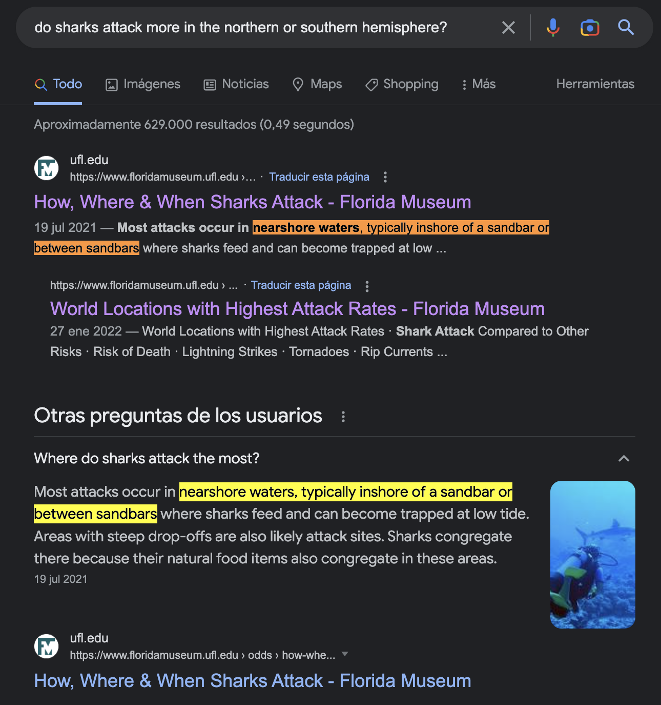

# Shark Attacks Data Cleaning

## PROJECT DESCRIPTION 
When working with data, one of the biggest challenges in obtaining reliable analysis is the quality of the data we use. And that depends on our measurements and also on how well we clean and treat the data. 
The goal of this first bootcamp project was to apply different data cleaning and data treatment techniques to obtain meaningful information from it. Different visualization methods were then used to perform an analysis and interpretation of the "cleaned" data.

## DATASET
The "Global Shark Attacks" dataset has been imported from Kaggle and includes a large incident record of shark attacks up to 2018. The dataset consists of 25723 rows and 24 columns and has a "usability" of 5.88 out of 10 on Kaggle.

## HIPOTHESIS
* hypothesis 1: Sharks attack equally in the northern hemisphere and in the southern hemisphere.

* hypothesis 2: Australia is the continent with the highest number of shark attacks.
* hypothesis 3: More cases of attacks are recorded in summer than in other seasons.

## WORKFLOW
* EXPLORE: preliminary analysis of the dataset to see the format and layout of the content and identify information that may be useful to test the hypotheses.
* CLEAN: cleaning of the values that are not of interest for our analysis.
* TRANSFORM: apply various methods to modify existing columns and create new ones with information.
* VISUALIZE: visually represent the extracted data by means of graphs in order to contrast the hypotheses.
